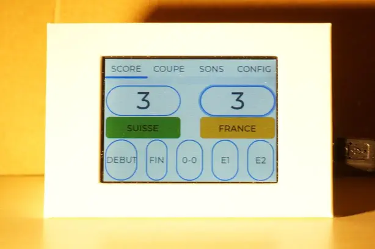

# NorthSec 2023 Badge transformation

## Général

L'appareil est issue de la competition CTF NorthSec 2023 https://nsec.io/

L'objectif est de transformer en écran pour gérer les score de jeux de soccer en mode local pour des jeux avec des personnages en plastiques.



[Video démonstration](medias/demo.mkv)

[Autre exemples](medias/)

## Informations techniques

La carte de base est `ESP32-2432S028R` disponible ici https://www.aliexpress.com/item/1005004502250619.html?spm=a2g0o.order_list.order_list_main.144.76881802IyLAn1
Le microcontrôleur est `ESP32-D0WDQ6` avec wifi and bluetooth.

Le logiciel utilisé pour le développement est ESP-IDF `Espressif IoT Development Framework`. Il permet de gérer correctement le secure boot. L'équipe du NorthSec qui a fait le développement de base à ajouté suffisamment d'informations utiles pour réaliser la recompilation.

## Contraintes

L'équipe du NorthSec a activé Secure Boot sur le ESP32 embarqué sur la carte qui contraint d'utiliser cette chaîne identique car non disponible avec autre chose.
Le code est issue du partage par l'équipe du Nsec https://github.com/nsec/nsec-badge-controller-screen.git
L'analyse avec un objectif précédent a été reporté dans un GitHub gist https://gist.github.com/jingl3s/d3b9c6e94bbc9816efcc9a8bb6d47e0d

## Morceaux importants

- Il a fallut effectuer quelques adaptations aux scripts fournis car des incompatibilités avaient apparu avec la version de base
- Une envie de supprimer un maximum des marges pour utiliser les zones au maximum car les zones vides ne sont pas le bienvenue dans les interfaces logiciels. Ca apporte seulement un coté esthétique
- Utilisation de `#idef` pour supporter le simulateur et la compilation en mode dégradé pour pouvoir mettre en place rapidement l'interface sans reprogrammer
- Le code mis en oeuvre n'est sûrement pas optimale mais il fait le travail par rapport au temps passé

## Liste des choses mises en places

- [x] Changer le style pour supprimer les marges
  - Difficulté mais trouvé un contournement
- [x] Bouton fin de match
- [x] Fin de match bip 3 fois
  - buzzer.h boucle sur tous les sont depuis un nouveau tab dédié pour tous les écouter
- [x] Chaque équipe a une couleur
- [x] Affichage des équipes par rapport une liste d'équipes disponibles
- [x] Lors réinitialisation 0-0 alors change les équipes avec random
- [x] Revoir les random pour éviter celui ESP qui active BT et WIFI
- [x] Changer la couleur de la led
- [x] Régler la luminosité écran
- [x] Supprimer le code de mesh
- [x] Permettre de jouer n'importe quel son du module
- [x] Choisir une coupe différente avec des équipes associés

Non réalisé

- Fin de match non possible si egalite
- Fin de match bloque mise a jour score jus'au réinitialisation
- Change la couleur de fond vers l'équipe qui a gagné
- Fin de match change couleur led vers la couleur équipe gagné

## Code utile

- [debug.cpp](esp32/components/display/display.cpp) Écrans mis en oeuvre avec les tabulation
- [main.cpp](esp32/main/main.cpp) programme principale
- LEDC control la luminosité de l'écran
  - [display_ledc_backlight.cpp](esp32/components/display_ledc_backlight/display_ledc_backlight.cpp) Gestion luminosité écran
  - GPIO PIN 21
  - Dossier utilisé [esp32/components/display_ledc_backlight](esp32/components/display_ledc_backlight)
  - UTilisation des fonctions depuis [esp32/components/buzzer/buzzer.cpp](esp32/components/buzzer/buzzer.cpp)
  - Doc constructeur de la lib https://docs.espressif.com/projects/esp-idf/en/stable/esp32/api-reference/peripherals/ledc.html
  - Utilisation du paramètre Duty permet de gérer le cycle de la PWM pour mettre plus ou moins lumineux
  - Idées depuis :
    - Tutoriel qui apres mise à jour avec le code permettait de l'utiliser https://medium.com/jungletronics/esp32-idf-ledc-get-started-f973c4b7e41e
    - https://github.com/roughleaf/ESP32-LEDC-library-with-ESP-IDF-CPP/blob/main/CPPLEDC/src/CPPLEDC/cppledc.cpp
    - Réglages de base https://github.com/witnessmenow/ESP32-Cheap-Yellow-Display/blob/main/Examples/Basics/4-BacklightControlTest/4-BacklightControlTest.ino

## Difficultés

- La bibliothèque LVGL permet de définir l'interface et d'appliquer des styles
  - Le `container` n'a pas permit de supprimer les marges et de pouvoir utiliser toute la zone d'affichage
- Interaction pour afficher la led de couleur a demandé pas mal d'aller retour
- La mise en place du simulateur a pris du temps pour découvrir que IDF utilise la version 7.4 de LVGL et non la dernière version

## Conclusion

- LVGL est vraiment un bibliothèque avancé pour tout code embarqué avec plusieurs simulateurs bien utils. Bien plus simple à utiliser que [LUMA](https://luma-oled.readthedocs.io/en/latest/index.html)
- Le secure boot du ESP32 ne peut se faire désactiver pour retransformer une carte en mode défaut
- La chaîne d'outil IDF permet de faire beaucoup de magie de mise en place et compilation pour notre bonheur sans avoir besoin de lire des tonnes de documentations
- La durée de mise en oeuvre a dépassé la limite originale de 1 mois à presque 2.5 mois avec seulement quelques heures par fin de semaine.

## Utilisation

### Simulateur

[Simulateur dossier](simulation/README.md)
Parce que c'est bien pratique de mettre au point une interface confortablement dans son environment de bidouille.

### Programmation du logiciel

#### Utilisation depuis la release

Il est possible de prendre les fichiers associés à la release pour éviter toute l'installation de l'environnement.

Nécessite d'avoir esptools pour fonctionner.
Extraire l'archive et ensuite suivre les commandes suivantes

```shell
python3 -m venv venv_esptool
source venv_esptool/bin/activate
./secure_reflash.sh
```

#### Construction

Le texte suivant est issue des notes disponible dans le projet originel.
Il est conservé dans sa langue d'origine avec certaines modifications pour le faire fonctionner.

<hr>

The badge firmware is based on
[ESP-IDF](https://www.espressif.com/en/products/sdks/esp-idf), the exact version used is commited to this repository since it has local changes.

```bash
git clone https://github.com/jingl3s/nsec-badge-display-other.git
cd nsec-badge-display-other/
./esp-idf/install.sh

# You need to manually install the Pillow package.
pip install Pillow jinja2

# Due to some updates in dependencies need to rebuild intermediate files manually
cd esp-idf/components/mbedtls/mbedtls
make
cd -
```

The installation procedure for your OS may differ a little, please consult the
[documentation website](https://docs.espressif.com/projects/esp-idf/en/stable/esp32/get-started/index.html#installation-step-by-step)
if you have any difficulties.

Once the installation is complete you can build the firmware and flash it to
the badge:

```bash
source esp-idf/export.sh
cd esp32/
idf.py build
```

If for some reason `idf.py` is not able to complete the operation, refer to the
[ESP-IDF documentation](https://docs.espressif.com/projects/esp-idf/en/stable/esp32/get-started/index.html#step-9-flash-onto-the-device).

## Flashing

Devices used during the competition were using ESP's secure boot v2 to prevent solving challenges by simply reading the flash data. The flash encryption key and the secure boot key are included in this repository.

If you are flashing a brand new, non secure-boot board:

```bash
idf.py build flash monitor
```

If you want to update the firmware on a board that has already been flashed with secure boot, for instance one of those we gave to participants during the competition:

```bash
./esp32/secure_reflash.sh /dev/ttyUSB0
```

If, for some reason, you want to flash a board with secure boot for the first time (this is the script that was used to prepare the boards before the competition):

```bash
./esp32/secure_flash.sh /dev/ttyUSB0
```

## Liens utils

- LVGL
  - Onglet (Tab View) https://docs.lvgl.io/7.11/widgets/tabview.html?highlight=tab%20view
  - Style https://docs.lvgl.io/7.11/overview/style.html?highlight=background
  - Code source https://github.com/lvgl/lvgl/tree/master
- Marges et padding https://docs.lvgl.io/8.2/overview/coords.html?highlight=margin
- Luminosité https://github.com/witnessmenow/ESP32-Cheap-Yellow-Display/blob/main/Examples/Basics/4-BacklightControlTest/4-BacklightControlTest.ino
- Demos https://github.com/lvgl/lv_demos
